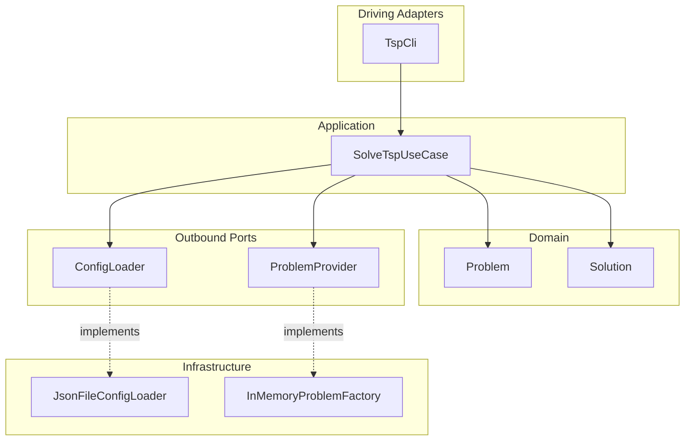

# Architecture

This project uses **Hexagonal Architecture** (Ports and Adapters) to keep the core solving logic independent of file I/O, configuration, and presentation.

## Target Architecture

## Layers

| Layer | Role | Key types |
|-------|------|-----------|
| **Domain** | Pure business concepts, no I/O | `Problem`, `Solution`, `EuclideanProblem`, `DistanceMatrixProblem` |
| **Application** | Ports (interfaces) and use cases | `TspSolver`, `ConfigLoader`, `ProblemProvider`, `SolveTspUseCase`, `SimpleSolver`, `PermutationsIterator` |
| **Infrastructure** | Adapters that implement ports | `JsonFileConfigLoader`, `InMemoryProblemFactory`, `JSONParsing`, `ProblemFactory` |
| **Adapter (driving)** | Entry point, wires and runs the app | `TspCli`, `TravellingSalesman` (composition root) |

## Dependency Rule

- **Domain** has no dependencies on other packages.
- **Application** depends only on domain and its own ports.
- **Infrastructure** implements application ports; depends on application and domain.
- **Driving adapters** depend on application (and infrastructure only for wiring in `main`).

## Flow

1. **TravellingSalesman.main** (composition root) instantiates adapters and the use case, then calls `TspCli.run()`.
2. **TspCli** loads configuration via `ConfigLoader`, creates a problem via `ProblemProvider`, invokes `TspSolver.solve()`, and prints the solution.
3. **SolveTspUseCase** delegates to `SimpleSolver`, which returns a `Solution`.
4. All file I/O and JSON parsing stays in infrastructure; the application core stays pure.
